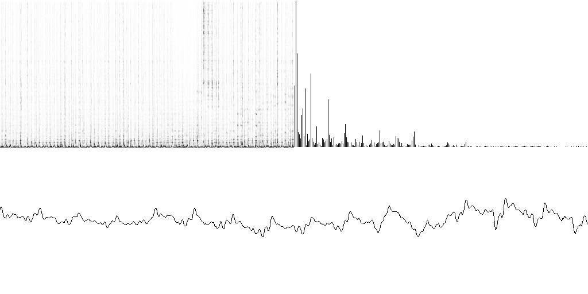

## MPD audio displays

### Write-up
A completely experimental and educational experience (for me, anyway)
on digital signal processing, graphics, and learning new languages and APIs.

All of the implementations follow the basic idea, they open the named pipe,
/tmp/mpd.fifo, and read in 1024 16-bit samples from the audio stream.

The input data is then drawn to the screen after being shuffled through a math
function to centre it around 256, and then a FFT is performed on the data.
Then, this data is drawn to the screen.

### Implementations
- C implementation using FFTW3 and SDL + OpenGL
(former C implementations removed -- view commit history)
- Python - two implementations, one uses pygame and the other uses pyglet.
Both of the implementations use the same FFT library, numpy.
The pyglet implementation is currently unfinished (purely because the OpenGL
book is so difficult to read).
- Lua - uses LÖVE 0.9.0 and luafft
- Commmon Lisp - cl-opengl and lispbuilder-sdl
- Scheme - in the works, planning to use guile-2d and a currently undecided fft library
- Matlab for shits n' giggles, the five-line, five-minute implementation
for fun

# Licensing
Honestly, I haven't taken the time to learn licensing rules, but I'm aware that any
project that uses FFTW must be released under the GPL.

I think that technically makes the C implementation GPL, but I'm not sure
how it affects the other ones.
